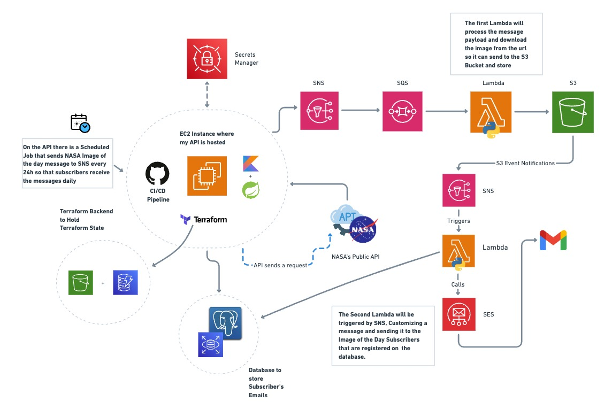

# 🛰️ NASA Image of the Day - Project Overview

This project automates the retrieval, processing, and distribution of NASA's Image of the Day using AWS services, a custom API, and a CI/CD pipeline. The architecture is designed for scalability, reliability, and maintainability using Terraform, AWS Lambda, and modern development practices.

This project is an AWS Showcase to Practice AWS Development Skills and CI/CD creation and integration

---

## 🧭 Actual Architecture



### 💡 Step by Step

1. **EC2 Instance / API**  
   A Kotlin and Sprint based API hosted on an EC2 instance, we can make a POST Request so that it sends NASA Image of the Day (Retrieved from Nasa's API) to all the emails whose subscription are on SES service or we can just let the Scheduled Job that run every 24 hours send the message to SNS and then it follows the workflow until it gets to the User


2. **Secrets Manager**  
   It contains NASA's API KEY and PostgreSQL Database Credentials


3. **SNS (Simple Notification service)**  
   As the POST Request Proceeds (Or as the Scheduled Job runs), the message containing Nasa's API Content is published to an SNS topic.


4. **SQS (Simple Queue service)**  
   The message from SNS goes to an SQS queue and then is sent to the first Lambda


5. **First Lambda (Image Downloader)**
    - Triggered by SQS
    - Downloads the image using the provided URL on the upcoming message
    - Then it uploads the image to an S3 bucket


6. **S3 (Simple Storage service)**  
   Stores the NASA image, and sends IMAGE to SNS using upload events


7. **SNS**
   - Receives data sent from S3 upload events
   - Sends the messages coming from S3 to the destination (Lambda)


8. **Second Lambda #2 (Notifier)**
    - Triggered by SNS
    - Reads the image metadata and builds a custom message (So it can send in a very customized way, SES email templates are not really friendly for intense modifications)
    - Downloads the image to temporary Lambda storage (/tmp).
    - Sends the email to a recipient specified in the environments using Amazon SES with the image attached and a nicely formatted body.


9. **SES (Simple Email service)**
   - Delivers the email to the recipient (The registered and confirmed users on the PostgreSQL Database), including The picture, the custom subject and customized body text


10. **CI/CD & Terraform**  
   The entire infrastructure is managed using Terraform (*IaC*), including backend state storage in S3 so that we can avoid conflicts. GitHub and CI/CD pipeline are used to ensure consistent deployment.
---

## 🚀 Technologies on the project

- **AWS IAM**
- **AWS EC2**
- **AWS Lambda**
- **AWS SNS & SQS**
- **AWS S3**
- **AWS DynamoDB**
- **AWS SES**
- **AWS Secrets Manager**
- **Terraform**
- **Kotlin**
- **Spring Boot**
- **GitHub CI/CD**
- **NASA's Public API** - https://api.nasa.gov/ 

---

##  My References
- **https://medium.com/@deepeshjaiswal6734/setting-up-terraform-with-s3-backend-and-dynamodb-locking-1e4b69e0b3cd**
- **https://github.com/aws-actions/configure-aws-credentials**
- **https://registry.terraform.io/providers/hashicorp/aws/latest/docs**
- **https://medium.com/@pathirage/step-in-to-ci-cd-a-hands-on-guide-to-building-ci-cd-pipeline-with-github-actions-7490d6f7d8ff**

### ⚙️🛠️ How to Run the Project?

#### 1. Fork the Repository

Start by forking this repository to your GitHub account.

---

#### 2. Set GitHub Actions Secrets

Go to your repository:

**Settings > Secrets and variables > Actions**

Add the following secrets:

- `AWS_ACCESS_KEY_ID` – Your AWS access key for programmatic access
- `AWS_SECRET_ACCESS_KEY` – The secret key associated with your AWS access key ID
- `AWS_REGION` – AWS region to deploy to (default: `us-east-1`)
- `DB_USERNAME` – Username for the PostgreSQL RDS instance
- `DB_PASSWORD` – Password for the PostgreSQL RDS instance
- `EC2_SSH_KEY` – Name of the EC2 SSH key pair
- `EC2_SSH_PRIVATE_KEY` – Content of the `.pem` private key used for SSH
- `HOST_DNS` – Public DNS or IP address of the EC2 instance
- `USER_IP` – Your public IP address (used to allow SSH access)

---

#### 3. Set AWS Secrets Manager Values

In **AWS Secrets Manager**, create the following secrets:

- `pgsql_access_nasaws_db` – with this JSON format:

  ```json
  {
    "dbname": "your-db-name",
    "host": "your-db-host",
    "port": "your-db-port",
    "username": "your-db-username",
    "password": "your-db-password"
  }

#### 4. Replace AWS Account ID

Throughout the codebase, the AWS account ID is hardcoded as:

`699475950124`

🔁 Replace **every occurrence** of this value with your own AWS Account ID.

---

#### 5. (Optional) Change AWS Region

The default AWS region I used was:

`sa-east-1`

🌎 If you'd like to use a different region:

- Update the `AWS_REGION` secret in your repository settings
- Modify any region-specific configurations in your code or Terraform scripts
