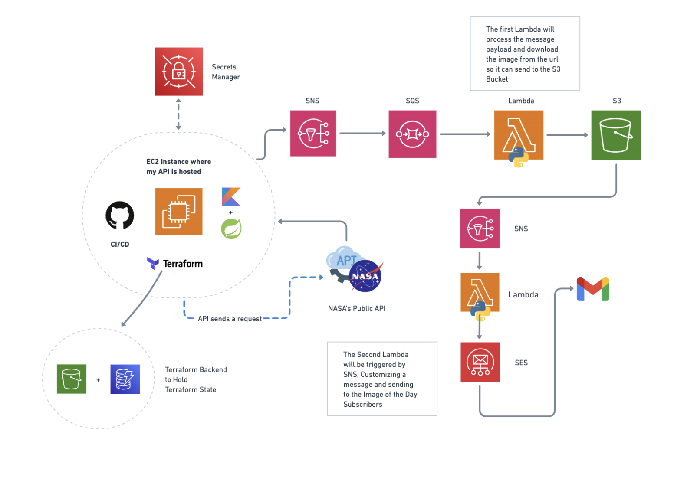

# 🛰️ NASA Image of the Day - Project Overview

This project automates the retrieval, processing, and distribution of NASA's Image of the Day using AWS services, a custom API, and a CI/CD pipeline. The architecture is designed for scalability, reliability, and maintainability using Terraform, AWS Lambda, and modern development practices.

This project is an AWS Showcase to Practice AWS Development Skills and CI/CD creation and integration

---

## 🧭 Actual Architecture

### 💡 Step-By-Step

1. **EC2 Instance / API**  
   A Kotlin-based API hosted on an EC2 instance, we can make a POST Request so that it sends NASA Image of the Day (Retrieved from Nasa's API) to all the emails whose subscription are on SES Service

2. **Secrets Manager**  
   There its managed NASA's API KEY, used to Retrieve the IOTD (Image of The Day)

3. **SNS (Simple Notification Service)**  
   As the POST Request Proceeds, the message containing Nasa's API Content is published to an SNS topic.

4. **SQS (Simple Queue Service)**  
   The message from SNS goes to an SQS queue and then is sent to the first Lambda

5. **First Lambda (Image Downloader)**
    - Triggered by SQS
    - Downloads the image using the provided URL on the upcoming message
    - Then it uploads the image to an S3 bucket

6. **S3 (Simple Storage Service)**  
   Stores the NASA image, and sends IMAGE to SNS using upload events

7. **SNS**
   - Receives data sent from S3 upload events
   - Sends the messages coming from S3 to the destination (Lambda)

8. **Second Lambda #2 (Notifier)**
    - Triggered by SNS
    - Reads the image metadata and builds a custom message (So it can send in a very customized way, SES email templates are not really friendly for intense modifications)
    - Downloads the image to temporary Lambda storage (/tmp).
    - Sends the email to a recipient specified in the environments using Amazon SES with the image attached and a nicely formatted body.

9. **SES (Simple Email Service)**
   - Delivers the email to the recipient (SES_RECIPIENT_EMAIL), including The picture, the custom subject and body text

10. **CI/CD & Terraform**  
   The entire infrastructure is managed using Terraform (*IaC*), including backend state storage in S3. GitHub and CI/CD pipeline are used to ensure consistent deployment.
---

## 🚀 Technologies on the project

- **AWS IAM**
- **AWS EC2**
- **AWS Lambda**
- **AWS SNS & SQS**
- **AWS S3**
- **AWS DynamoDB**
- **AWS SES**
- **AWS Secrets Manager**
- **Terraform**
- **Kotlin**
- **Spring Boot**
- **GitHub CI/CD**
- **NASA's Public API** - https://api.nasa.gov/ 

---

##  My References
- **https://medium.com/@deepeshjaiswal6734/setting-up-terraform-with-s3-backend-and-dynamodb-locking-1e4b69e0b3cd**
- **https://github.com/aws-actions/configure-aws-credentials**
- **https://registry.terraform.io/providers/hashicorp/aws/latest/docs**
- **https://medium.com/@pathirage/step-in-to-ci-cd-a-hands-on-guide-to-building-ci-cd-pipeline-with-github-actions-7490d6f7d8ff**

###  How to Run the project?
To-do
